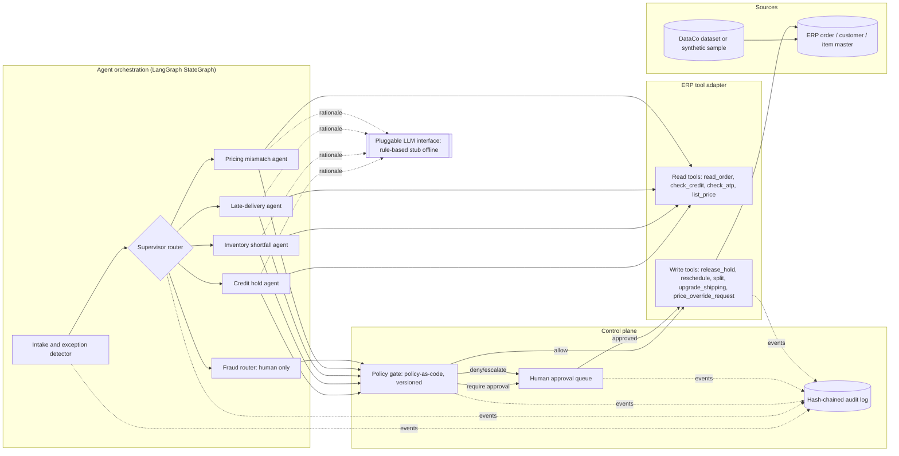

# Component diagram

```mermaid
flowchart LR
  subgraph Sources
    ERPR[(ERP order / customer / item master)]
    DS[(DataCo dataset or synthetic sample)]
  end
  subgraph Orchestration["Agent orchestration (LangGraph StateGraph)"]
    IN[Intake and exception detector] --> SUP{Supervisor router}
    SUP --> CA[Credit hold agent]
    SUP --> IA[Inventory shortfall agent]
    SUP --> LA[Late-delivery agent]
    SUP --> PA[Pricing mismatch agent]
    SUP --> FR[Fraud router: human only]
  end
  subgraph Control["Control plane"]
    PG[Policy gate: policy-as-code, versioned]
    HITL[Human approval queue]
    AUD[(Hash-chained audit log)]
  end
  subgraph Tools["ERP tool adapter"]
    RT[Read tools: read_order, check_credit, check_atp, list_price]
    WT[Write tools: release_hold, reschedule, split, upgrade_shipping, price_override_request]
  end
  LLM[[Pluggable LLM interface: rule-based stub offline]]
  DS --> ERPR
  CA & IA & LA & PA --> RT
  CA & IA & LA & PA -.rationale.-> LLM
  CA & IA & LA & PA & FR --> PG
  PG -- allow --> WT
  PG -- require approval --> HITL -- approved --> WT
  PG -- deny/escalate --> HITL
  WT --> ERPR
  IN & SUP & PG & HITL & WT -.events.-> AUD
```
