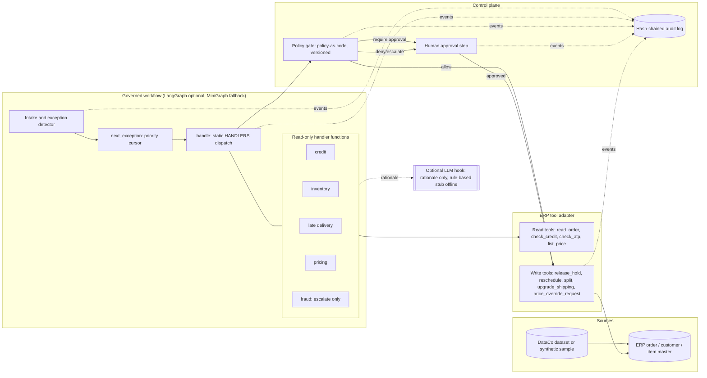

# Component diagram

```mermaid
flowchart LR
  subgraph Sources
    ERPR[(ERP order / customer / item master)]
    DS[(DataCo dataset or synthetic sample)]
  end
  subgraph Workflow["Governed workflow (LangGraph optional, MiniGraph fallback)"]
    IN[Intake and exception detector] --> NX[next_exception: priority cursor]
    NX --> HD[handle: static HANDLERS dispatch]
    subgraph Handlers["Read-only handler functions"]
      CH[credit] ~~~ IH[inventory] ~~~ LH[late delivery] ~~~ PH[pricing] ~~~ FH[fraud: escalate only]
    end
    HD --- Handlers
  end
  subgraph Control["Control plane"]
    PG[Policy gate: policy-as-code, versioned]
    HITL[Human approval step]
    AUD[(Hash-chained audit log)]
  end
  subgraph Tools["ERP tool adapter"]
    RT[Read tools: read_order, check_credit, check_atp, list_price]
    WT[Write tools: release_hold, reschedule, split, upgrade_shipping, price_override_request]
  end
  LLM[[Optional LLM hook: rationale only, rule-based stub offline]]
  DS --> ERPR
  Handlers --> RT
  Handlers -.rationale.-> LLM
  HD --> PG
  PG -- allow --> WT
  PG -- require approval --> HITL -- approved --> WT
  PG -- deny/escalate --> HITL
  WT --> ERPR
  IN & HD & PG & HITL & WT -.events.-> AUD
```
