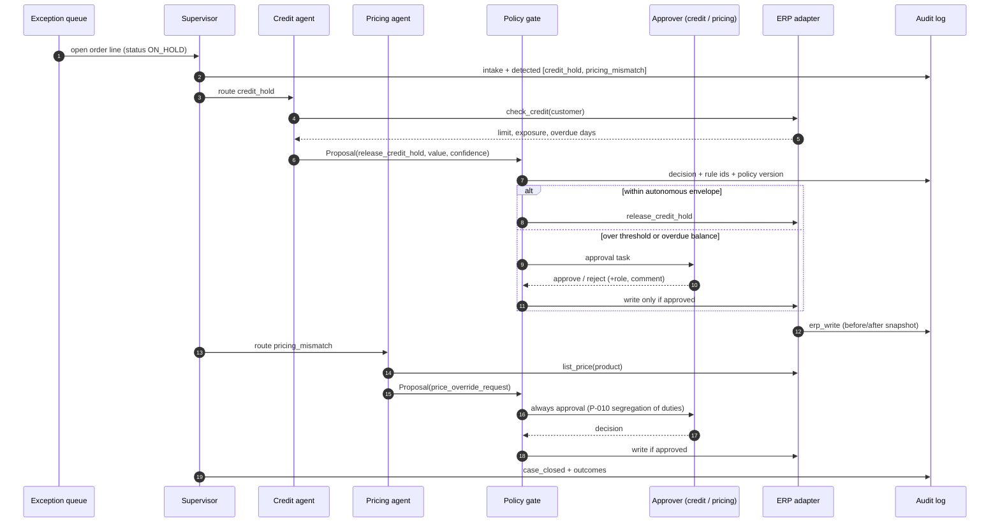

# Sequence: one order with a credit hold and a pricing mismatch

```mermaid
sequenceDiagram
  autonumber
  participant Q as Exception queue
  participant S as Supervisor
  participant C as Credit agent
  participant P as Pricing agent
  participant G as Policy gate
  participant H as Approver (credit / pricing)
  participant E as ERP adapter
  participant A as Audit log
  Q->>S: open order line (status ON_HOLD)
  S->>A: intake + detected [credit_hold, pricing_mismatch]
  S->>C: route credit_hold
  C->>E: check_credit(customer)
  E-->>C: limit, exposure, overdue days
  C->>G: Proposal(release_credit_hold, value, confidence)
  G->>A: decision + rule ids + policy version
  alt within autonomous envelope
    G->>E: release_credit_hold
  else over threshold or overdue balance
    G->>H: approval task
    H-->>G: approve / reject (+role, comment)
    G->>E: write only if approved
  end
  E->>A: erp_write (before/after snapshot)
  S->>P: route pricing_mismatch
  P->>E: list_price(product)
  P->>G: Proposal(price_override_request)
  G->>H: always approval (P-010 segregation of duties)
  H-->>G: decision
  G->>E: write if approved
  S->>A: case_closed + outcomes
```
