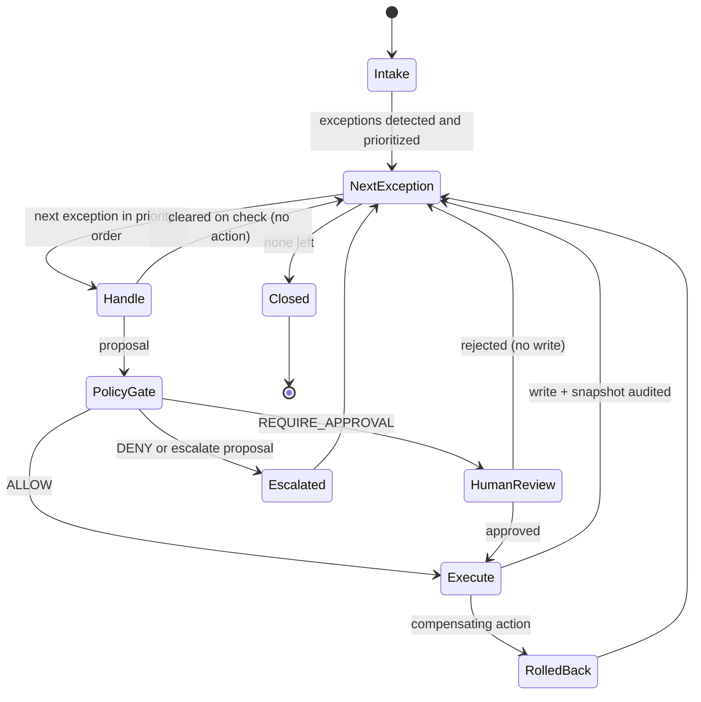

# Case state machine (with human-in-the-loop)

```mermaid
stateDiagram-v2
  [*] --> Intake
  Intake --> NextException: exceptions detected and prioritized
  NextException --> Handle: next exception in priority order
  NextException --> Closed: none left
  Handle --> PolicyGate: proposal
  Handle --> NextException: cleared on check (no action)
  PolicyGate --> Execute: ALLOW
  PolicyGate --> HumanReview: REQUIRE_APPROVAL
  PolicyGate --> Escalated: DENY or escalate proposal
  HumanReview --> Execute: approved
  HumanReview --> NextException: rejected (no write)
  Execute --> NextException: write + snapshot audited
  Execute --> RolledBack: compensating action
  RolledBack --> NextException
  Escalated --> NextException
  Closed --> [*]
```
